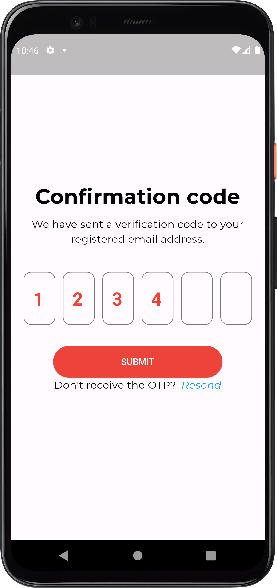

# HOTELIER

## Author
Thuong Trinh Van - trinhvanthuong20012000@gmail.com

## Description
A Hotelier app is a specialized application designed to streamline and enhance the management and operations of hotels, resorts, or any hospitality establishments. It is tailored to meet the unique needs of hotel owners, managers, and staff, providing a comprehensive solution to efficiently run various aspects of the business.

## Screenshots

Intro Page | Welcome Page | Firat Guide Page
--- | --- | ---
 |  | 
 |  | 
 |  | 
| --- | ---

## Features

- 
- 
- 

## Installation

1. Clone the repository:

   ```bash
   git clone https://github.com/JasmineVan/Hotelier.git

2. Change to the project directory:

   ```bash
   cd Hotelier

3. Install dependencies:

   ```bash
   flutter pub get

4. Run the app:

   ```bash
   flutter run

# Usage
1. Open the app.
2. 
3. 
4. 
5. 

# Acknowledgements
API for providing the food data made by 1C Enterprise 8.3.18. 
The complete API documentation will be released soon!
This app was developed using Flutter.
Special thanks to the Flutter community for their support and resources.
